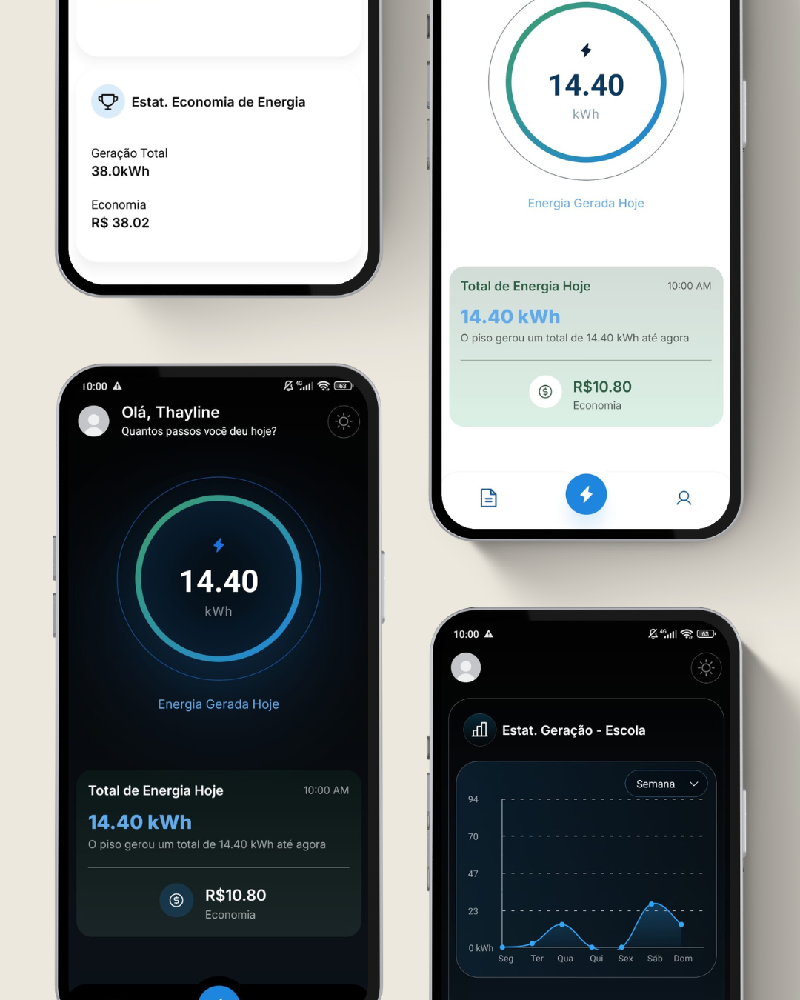

# ⚡ Step It
### Transformando passos em energia — e dados

Sistema completo de geração e monitoramento de energia a partir do movimento humano.

O **Step It** integra hardware e software para transformar passos em energia elétrica e permitir o acompanhamento da geração em tempo real por meio de um aplicativo mobile.

---

# 📱 Visualização do aplicativo

## Baixar o aplicativo (APK)

📥 Teste o aplicativo diretamente no seu celular(somente para android):

👉 **Download do APK**  
https://expo.dev/accounts/thayline07/projects/Step-It/builds/8a9e09af-20e1-455f-8d15-7fdc22eed95b

---

## Interface do aplicativo

  

O aplicativo foi desenvolvido com foco em:

- visual moderno
- leitura rápida de dados
- experiência intuitiva
- modo claro e modo escuro
- acompanhamento em tempo real da geração de energia

---

# 💡 Sobre o projeto

O **Step It** foi desenvolvido como um projeto de inovação tecnológica inspirado em soluções sustentáveis para cidades inteligentes.

A ideia é simples:

Pessoas caminham sobre pisos especiais instalados em locais com grande circulação e cada passo gera energia elétrica que pode ser monitorada em um aplicativo.

Locais ideais para uso:

- escolas
- universidades
- estações de transporte
- empresas
- hospitais
- espaços públicos

---

# ⚙️ Como funciona o piso gerador

O sistema físico utiliza um mecanismo mecânico que converte o movimento do passo em energia elétrica.

Funcionamento:

1. Quando uma pessoa pisa no piso, uma estrutura mecânica se movimenta.
2. Esse movimento ativa uma **barra dentada**.
3. A barra dentada gira um conjunto de **engrenagens**.
4. As engrenagens acionam um **motor elétrico** que funciona como gerador.
5. A energia gerada é convertida e medida por sensores.
6. Os dados são enviados para o sistema.

Esse processo ocorre rapidamente e pode ser repetido milhares de vezes por dia em locais com alto fluxo de pessoas.

---

# 🔌 Coleta de dados do sistema

Para monitorar a energia gerada, o sistema utiliza:

ESP32  
Sensores de corrente  
Sensores de tensão  

O ESP32 coleta os dados e envia para o backend.

Fluxo de dados:

Piso → Sensores → ESP32 → Firebase → Aplicativo

---

# 📊 O que o aplicativo mostra

O aplicativo permite que o usuário acompanhe:

Energia gerada no dia  
Histórico de geração  
Gráficos de desempenho  
Economia estimada  
Dispositivos cadastrados  

Funcionalidades principais:

- criação de conta
- login seguro
- cadastro de pisos
- monitoramento em tempo real
- visualização de gráficos
- estimativa de economia energética

---

# 🚀 Instalação do projeto

## Pré-requisitos

Node.js  
npm ou yarn  
Expo CLI  

---

## Clonar repositório

git clone https://github.com/thayline07/step-it.git

cd step-it

---

## Instalar dependências

npm install

---

## Rodar o projeto

npx expo start

---

# 📡 Exemplo de dados recebidos do hardware
{
energia: 14.4,
timestamp: "2024-01-01T10:00:00Z"
}

Esses dados são enviados pelo ESP32 e armazenados no Firebase.

---

# 🧪 Testes

Planejado para futuras versões:

Jest  
React Native Testing Library

---

# 🛣 Roadmap

Melhorias planejadas:

Dashboard web  
Notificações em tempo real  
Análise avançada de dados  
Sistema de ranking de geração de energia  
Melhorias de UX/UI  
Integração com mais sensores

---

# 🌱 Impacto do projeto

O objetivo do Step It é incentivar soluções sustentáveis e inteligentes para cidades modernas.

Benefícios:

energia limpa  
uso de energia gerada pelo movimento humano  
monitoramento inteligente  
conscientização ambiental

---

# 👩‍💻 Autora

Thayline Inês Simioni

Estudante de Matemática Aplicada e Computacional — UFRGS  
Desenvolvedora Front-end

Email: thaylinesimioni@gmail.com

---

# 📄 Licença

MIT
